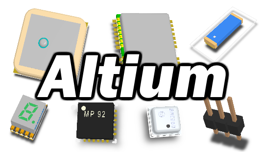

Библиотека элементов для Altium

### Содержание

* *rules* - настройки правил, на данный момент есть только для резонита
* *STEP* - 3Д модели элементов
* *Footprints* - Посадочные места для элементов
* *Symbols* - Условные обозначения элементов
* *datasheet* - Документация

Содержание библиотеки написано в отдельном файле *LIST.md*

### Полезные ссылки

* [http://www.3dcontentcentral.com](http://www.3dcontentcentral.com) сайт с поиском 3д моделей деталей
